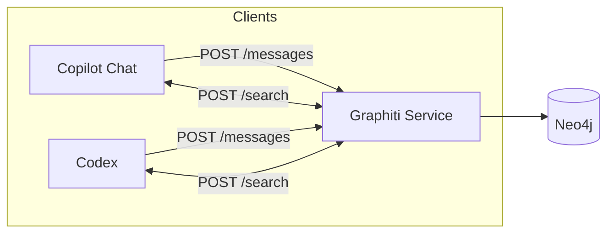

# Architecture

## High-level

## Ingest vs Recall

- **Ingest path (async):** clients send messages/episodes → Graphiti enqueues work → Graphiti extracts entities/facts and writes to Neo4j.
- **Recall path (sync):** clients query `/search` with a user/workspace/session `group_id` set → Graphiti returns fact edges used as memory context.

## Scopes

- **Session scope:** short-lived, per interactive run.
- **Workspace scope:** durable, tied to a repo/workspace root.
- **User scope:** durable, shared across clients for the same user identity.

## Schema selection

- Newer Graphiti builds may support `schema_id: "agent_memory_v1"` on `POST /messages` and/or an optional `POST /groups/resolve` endpoint.
- Clients must not depend on these endpoints for correctness; they use deterministic group ids and can embed `<graphiti_episode ...>` as plain text on older Graphiti builds.
