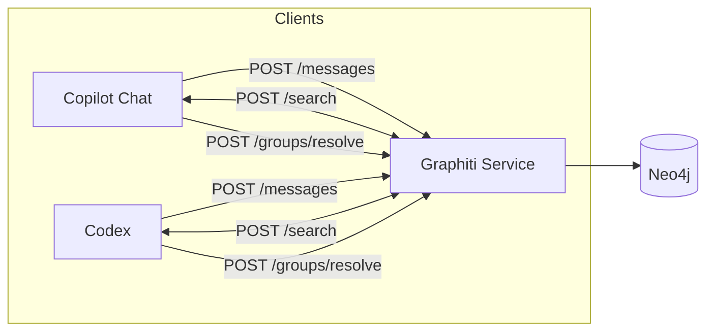

# Architecture

## High-level

## Ingest vs Recall

- **Ingest path (async):** clients send messages/episodes → Graphiti enqueues work → Graphiti extracts entities/facts and writes to Neo4j.
- **Recall path (sync):** clients query `/search` with a user/workspace/session `group_id` set → Graphiti returns fact edges used as memory context.

## Scopes

- **Session scope:** short-lived, per interactive run.
- **Workspace scope:** durable, tied to a repo/workspace root.
- **User scope:** durable, shared across clients for the same user identity.

## Schema selection

- Clients can set `schema_id: "agent_memory_v1"` on `POST /messages`.
- If omitted, Graphiti auto-selects `agent_memory_v1` when message content contains `<graphiti_episode ...>`.

